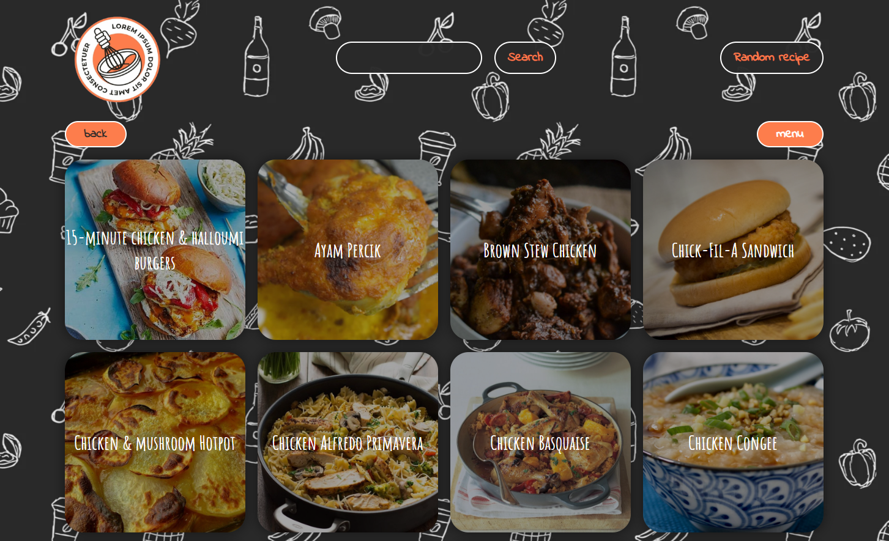

<h1 align="center">Cooking Guide</h1>

<h2 align="left">Описание проекта</h2>

**Cooking Guide** — это веб-приложение, которое предоставляет пользователю доступ к различным кулинарным рецептам, используя публичное API. Пользователь может просматривать рецепты по категориям, искать рецепты по названию или случайным образом, а также получать подробную информацию о каждом рецепте, включая ингредиенты и пошаговые инструкции.

Не знаешь что сегодня приготовить? - жми "Random recipe"!
 
 
 
Проект помогает улучшить навыки работы с JavaScript, API и манипуляциями с DOM.

Проект включает полностью кастомный дизайн, который был разработан мной с нуля.

Просмотреть проект можно на GitHub Pages по ссылке:  https://cicada0909.github.io/cookingGuide

<h2 align="left">Цель создания проекта</h2>

Закрепление навыков работы с **JavaScript** и **API**. Создание интерактивного веб-приложения с использованием **HTML**, **CSS** и **JavaScript** для предоставления пользователю удобного интерфейса для поиска и просмотра рецептов.

<h2 align="left">Основные функции проекта</h2>

1. Просмотр рецептов по категориям, таким как "Завтраки", "Десерты" и другие.
2. Поиск рецептов по названию блюда.
3. Возможность генерации случайного рецепта.
4. Просмотр подробной информации о рецепте, включая список ингредиентов и пошаговые инструкции.
5. Анимации и плавные переходы между страницами для улучшенного пользовательского опыта.
6. Валидация ввода при поиске блюд.

<h2 align="left">Функциональность и использованные технологии</h2>

- **HTML** и **CSS**: Структура страницы и внешний вид. Использованы адаптивные стили для корректного отображения на мобильных устройствах. Дизайн был разработан мной с нуля.
- **JavaScript**: Логика работы с API для получения данных о рецептах. Манипуляции с DOM для отображения рецептов, категорий, результатов поиска и случайных рецептов. Реализована анимация и плавные переходы между страницами.
- **API**: Взаимодействие с публичным API для получения информации о категориях рецептов, списках блюд и подробной информации о рецептах.

<h2 align="left">Основные особенности</h2>

- Просмотр рецептов по категориям и возможность фильтрации по категориям.
- Поиск рецептов по названию.
- Возможность получения случайного рецепта.
- Детальная информация о рецепте с ингредиентами и инструкциями.
- Анимации для плавных переходов между страницами и элементами интерфейса.
- Валидация ввода данных при поиске.

<h2 align="left">Планы по доработке проекта</h2>

1. Добавить возможность сохранения избранных рецептов.
2. Добавить фильтрацию рецептов по ингредиентам.
3. Улучшить внешний вид с дополнительными анимациями и эффектами.
